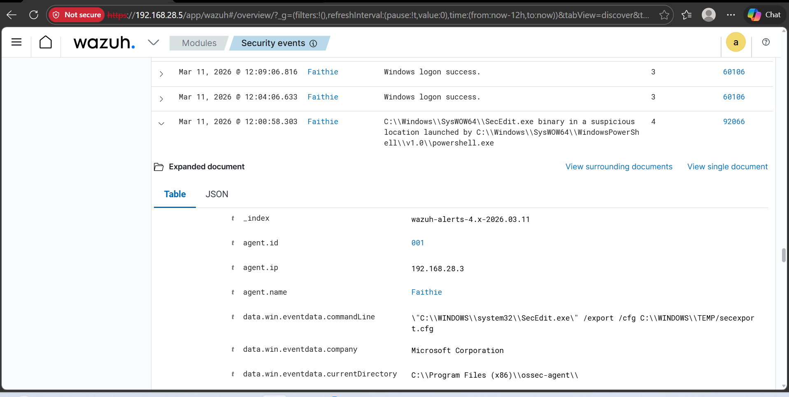
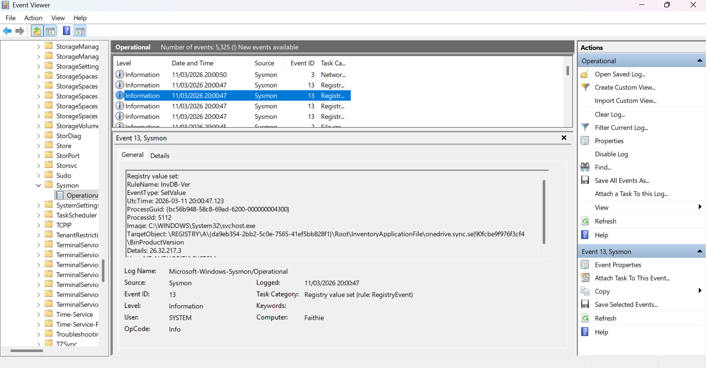
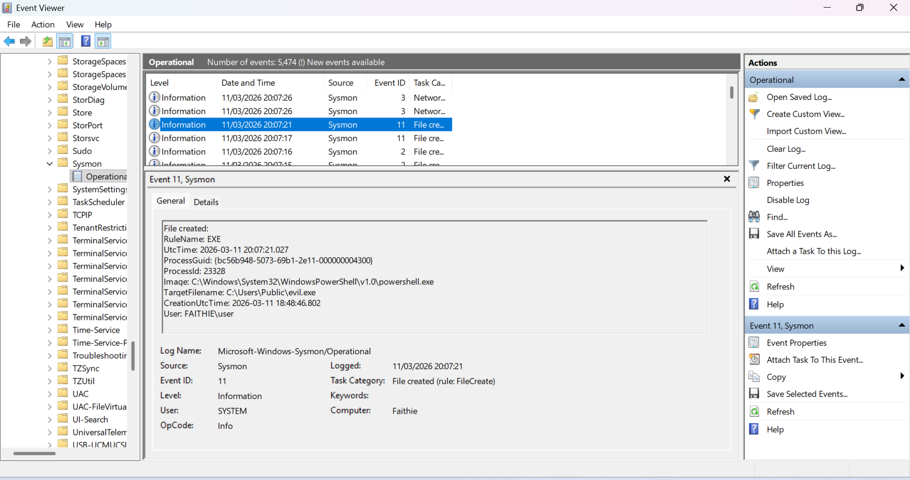
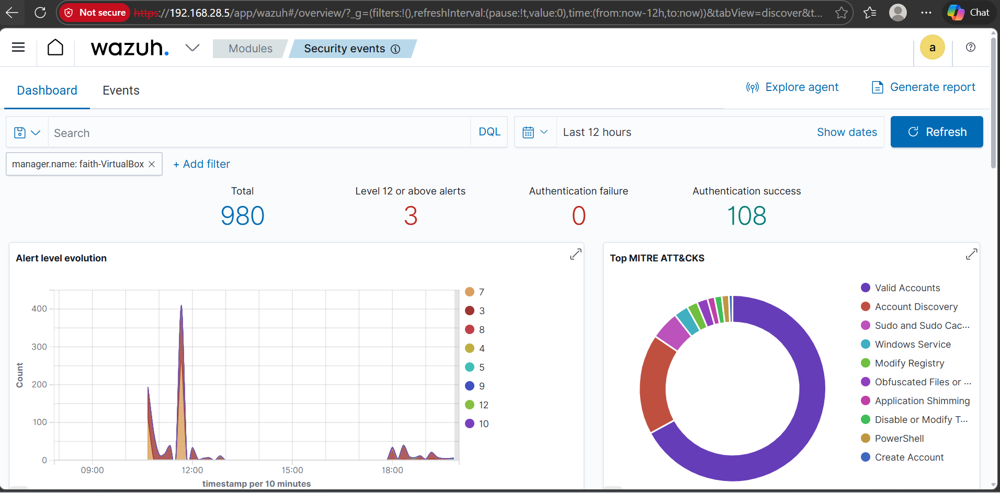

# Wazuh + Sysmon Endpoint Detection Lab

## Overview

This project demonstrates a small **Security Operations Center (SOC) monitoring lab** built using **Wazuh SIEM** and **Sysmon**.

The goal of this lab was to simulate how a SOC analyst monitors endpoint activity, detects suspicious behaviour, and investigates alerts generated from system telemetry.

In this setup:

- Sysmon collects endpoint telemetry from a Windows system
- The Wazuh agent forwards logs to the Wazuh manager
- Wazuh analyzes the logs and generates security alerts
- Activities are mapped to relevant **MITRE ATT&CK techniques**

This lab demonstrates **host-based detection, process monitoring, registry monitoring, file activity monitoring, and SIEM rule analysis**.

---

# Lab Architecture

```
Windows Endpoint
       │
       │  Sysmon Telemetry
       ▼
Wazuh Agent
       │
       │  Log Forwarding
       ▼
Wazuh Manager (Ubuntu)
       │
       ▼
Wazuh Dashboard (SIEM)
```

---

# Tools and Technologies

- **Wazuh SIEM**
- **Sysmon (Microsoft Sysinternals)**
- **Ubuntu Linux Desktop**
- **Windows Endpoint**
- **MITRE ATT&CK Framework**

---

# Detection Demonstrations

## 1. Encoded PowerShell Execution Detection

To simulate suspicious command execution, an encoded PowerShell command was executed.

Command used:

```powershell
powershell -EncodedCommand SQBFAFgA
```

This triggered a **Wazuh security alert**.

MITRE ATT&CK Technique:

```
T1059.001 — PowerShell Execution
```

Screenshot:



---

# 2. Registry Persistence Monitoring

To simulate persistence behaviour, a registry key was created under the Windows Run key.

Command used:

```powershell
reg add HKCU\Software\Microsoft\Windows\CurrentVersion\Run /v TestPersistence /t REG_SZ /d "notepad.exe" /f
```

Sysmon logged the registry modification as **Event ID 13 (RegistryEvent)**.

This demonstrates how endpoint telemetry can capture potential persistence techniques.

Screenshot:



---

# 3. File Creation Monitoring

A suspicious executable was copied into the Public directory to simulate a dropped payload.

Command used:

```powershell
copy C:\Windows\System32\cmd.exe C:\Users\Public\evil.exe
```

Sysmon detected this activity and logged:

```
Event ID 11 — FileCreate
```

Screenshot:



---

# Wazuh Dashboard Monitoring

The Wazuh dashboard provides a centralized view of security events and alerts generated from endpoint telemetry.

Screenshot:



---

# Custom Wazuh Rule Example

A custom rule was created to detect suspicious executables being dropped into the Public directory.

File location:

```
rules/wazuh-custom-rule.xml
```

Example rule:

```xml
<group name="sysmon,file_creation">
  <rule id="100010" level="10">
    <if_sid>61613</if_sid>
    <field name="data.win.eventdata.targetFilename">C:\\Users\\Public\\evil.exe</field>
    <description>Custom detection: suspicious executable dropped in Public folder</description>
  </rule>
</group>
```

---

# Skills Demonstrated

This project demonstrates the following SOC analyst skills:

- Host-based detection
- Endpoint telemetry monitoring
- Process execution analysis
- Registry persistence monitoring
- File activity monitoring
- SIEM rule analysis
- Security alert investigation
- MITRE ATT&CK mapping

---

# Conclusion

This lab demonstrates how endpoint telemetry from **Sysmon** can be ingested into **Wazuh SIEM** to monitor system activity and detect suspicious behaviour.

It simulates real-world SOC workflows where analysts investigate process execution, persistence techniques, and file activity using centralized security monitoring tools.

---

# Project Author

Faith Okonoboh
